# AgentProbe

[](https://github.com/dyrach1o/agentprobe-framework/actions/workflows/ci.yml)
[](https://github.com/dyrach1o/agentprobe-framework)
[](https://www.python.org/downloads/)
[](LICENSE)
[](https://pypi.org/project/agentprobe-framework/)

**A testing and evaluation framework for software agents.**

AgentProbe gives you the tools to test autonomous software agents the same way you'd test any critical software --- with structured assertions, regression detection, safety scans, cost tracking, and full execution tracing. If your agent calls tools, makes decisions, or produces non-deterministic output, AgentProbe helps you verify it works correctly and keeps working.

<p align="center">
  
</p>

---

## Who Is This For?

- **You build agents with LangChain, CrewAI, AutoGen, or MCP** and need to verify they work correctly after every change
- **You're shipping agents to production** and need cost guardrails, safety checks, and regression detection before each deploy
- **You want pytest-native testing** instead of custom scripts, notebooks, or SaaS dashboards
- **Your team needs reproducible agent tests** with structured traces, not ad-hoc print statements and manual spot-checks

If your agent calls tools, makes decisions, or produces non-deterministic output, AgentProbe helps you test it like any other critical software.

---

## How It Compares

| | AgentProbe | DeepEval | RAGAS | Promptfoo | LangSmith |
|---|:---:|:---:|:---:|:---:|:---:|
| **pytest native** | fixture | custom assert | -- | -- | -- |
| **Self-hosted** | yes | yes | yes | yes | SaaS |
| **Trace recording** | yes | -- | -- | -- | yes |
| **Cost tracking** | built-in (5 providers) | -- | -- | yes | yes |
| **Safety scanning** | 6 built-in suites | red teaming | -- | red teaming | -- |
| **Framework adapters** | 4 (LC, CrewAI, AutoGen, MCP) | -- | LangChain | provider-based | LangChain |
| **Regression detection** | yes | via cloud | -- | snapshots | yes |
| **Language** | Python | Python | Python | JS/YAML | Python |
| **License** | Apache 2.0 | Apache 2.0 | Apache 2.0 | MIT | Proprietary |

---

## Install

```bash
pip install agentprobe-framework
```

Optional extras:

```bash
pip install agentprobe-framework[postgres]     # PostgreSQL storage
pip install agentprobe-framework[eval]         # Embedding evaluators (numpy)
pip install agentprobe-framework[dashboard]    # REST API dashboard (FastAPI)
```

## Quick Start

### pytest Plugin (Recommended)

AgentProbe ships as a native pytest plugin. Install it and the `agentprobe` fixture is automatically available:

<p align="center">
  
</p>

```python
# test_my_agent.py
from agentprobe.testing import assert_trace, assert_score, assert_cost
from agentprobe.eval.rules import RuleBasedEvaluator, RuleSpec

evaluator = RuleBasedEvaluator(rules=[
    RuleSpec(rule_type="max_length", params={"max": 3000}),
])

async def test_greeting(agentprobe):
    trace = await agentprobe.invoke("Say hello", adapter=my_adapter)

    assert_trace(trace).has_output().contains("hello")
    await assert_score(trace, evaluator, min_score=0.8)
    assert_cost(trace, max_usd=0.01)
```

Run with standard pytest:

```bash
pytest tests/ -v
```

### Standalone CLI

<p align="center">
  
</p>

```bash
agentprobe init          # create agentprobe.yaml
agentprobe test -d tests/  # discover and run @scenario tests
```

### Scenario-Based Tests

```python
from agentprobe import scenario, expect

@scenario(name="greeting_test", input_text="Say hello", tags=["smoke"])
def test_greeting():
    """Agent should produce a friendly greeting."""
    pass
```

---

## Core Concepts

### Trace Recording

Every agent execution is captured as a **Trace** --- a structured record of every decision, tool call, and model invocation. Traces are immutable, storable, and replayable.

```python
from agentprobe.trace.recorder import TraceRecorder

recorder = TraceRecorder(agent_name="my-agent", model="claude-sonnet-4-5-20250929")

async with recorder.recording() as ctx:
    ctx.record_llm_call(model="claude-sonnet-4-5-20250929", input_tokens=150, output_tokens=80)
    ctx.record_tool_call(tool_name="search", tool_input={"query": "weather"})

trace = recorder.finalize(input_text="What's the weather?", output="It's sunny.")
# trace.llm_calls, trace.tool_calls, trace.total_input_tokens, etc.
```

### Fluent Assertions

Validate agent output with a chainable API that gives clear error messages on failure:

```python
from agentprobe import expect, expect_tool_calls

# Output assertions
expect(output).to_contain("Paris").to_not_contain("error").to_match(r"\d+ degrees")

# JSON validation
expect(output).to_be_valid_json()

# Tool call assertions
expect_tool_calls(trace.tool_calls).to_contain("search").to_have_count(3)
expect_tool_calls(trace.tool_calls).to_have_sequence(["search", "calculate", "respond"])
```

### Rule-Based Evaluation

Define evaluation rules that score agent output on multiple dimensions:

```python
from agentprobe.eval.rules import RuleBasedEvaluator, RuleSpec

evaluator = RuleBasedEvaluator(
    rules=[
        RuleSpec(rule_type="contains_any", params={"values": ["Paris"]}, weight=3.0),
        RuleSpec(rule_type="max_length", params={"max": 500}, weight=1.0),
        RuleSpec(rule_type="json_valid"),
        RuleSpec(rule_type="regex", params={"pattern": r"\d{4}"}),
        RuleSpec(rule_type="not_contains", params={"values": ["error", "fail"]}),
    ]
)

result = await evaluator.evaluate(test_case, trace)
# result.verdict: PASS | PARTIAL | FAIL
# result.score: 0.0 - 1.0 (weighted average)
```

### Cost Tracking

Track token usage and costs across providers. Supports Anthropic, OpenAI, Google, Mistral, and Cohere pricing out of the box:

```python
from agentprobe.cost.calculator import CostCalculator

calculator = CostCalculator()  # loads built-in pricing data
summary = calculator.calculate_trace_cost(trace)

print(f"Total: ${summary.total_cost_usd:.6f}")
for model, breakdown in summary.breakdown_by_model.items():
    print(f"  {model}: ${breakdown.total_cost_usd:.6f} ({breakdown.call_count} calls)")
```

Enforce budgets per-test or per-suite:

```python
from agentprobe.cost.budget import BudgetEnforcer

enforcer = BudgetEnforcer(test_budget_usd=0.10, suite_budget_usd=1.00)
check = enforcer.check_test(summary)
# check.within_budget, check.utilization_pct, check.remaining_usd
```

### Safety Scanning

<p align="center">
  
</p>

Run built-in suites that probe for common agent vulnerabilities:

```python
from agentprobe.safety.scanner import SafetyScanner

scanner = SafetyScanner()  # loads all built-in suites
result = await scanner.scan(adapter)
# result.total_passed, result.total_failed, result.suite_results
```

Built-in suites: **prompt injection**, **data leakage**, **jailbreak**, **role confusion**, **hallucination**, **tool abuse**.

### Regression Detection

Save baselines and detect when agent behavior degrades:

```python
from agentprobe.regression.baseline import BaselineManager
from agentprobe.regression.detector import RegressionDetector

manager = BaselineManager(baseline_dir="baselines/")
manager.save("v1.0", test_results)

# Later, after changes...
baseline = manager.load("v1.0")
detector = RegressionDetector(threshold=0.05)
report = detector.compare("v1.0", baseline, current_results)

print(f"Regressions: {report.regressions}, Improvements: {report.improvements}")
for comp in report.comparisons:
    if comp.is_regression:
        print(f"  {comp.test_name}: {comp.baseline_score:.2f} -> {comp.current_score:.2f}")
```

### Trace Replay and Diff

Replay recorded traces with mock overrides, or compare any two traces structurally:

```python
from agentprobe.trace.replay import ReplayEngine
from agentprobe.trace.diff import TraceDiffer

# Replay with mock tool
engine = ReplayEngine(mock_tools={"search": lambda inp: "mocked result"})
replayed = engine.replay(original_trace)
diff = engine.diff(original_trace, replayed)

# Structural comparison between any two traces
differ = TraceDiffer(similarity_threshold=0.8)
report = differ.diff(trace_a, trace_b)
# report.output_matches, report.token_delta, report.overall_similarity
```

### Security

Scan for PII, hash sensitive fields, and log security events:

```python
from agentprobe.security import PIIRedactor, FieldEncryptor, AuditLogger

# PII detection and redaction
redactor = PIIRedactor()
clean = redactor.redact("Email john@example.com, SSN 123-45-6789")
# "Email [EMAIL], SSN [SSN]"

# Field-level hashing and masking
encryptor = FieldEncryptor()
encryptor.hash_value("sensitive-data")     # deterministic SHA-256
encryptor.mask_value("4111111111111111")   # "************1111"

# Structured audit logging
from agentprobe.security.audit import AuditLogger, AuditEventType
logger = AuditLogger()
logger.log_event(AuditEventType.PII_REDACTION, details={"matches": 3})
```

---

## CLI Reference

| Command | Description |
|---------|-------------|
| `agentprobe init` | Create `agentprobe.yaml` configuration file |
| `agentprobe test -d <dir>` | Discover and run test scenarios |
| `agentprobe trace list` | List recorded execution traces |
| `agentprobe trace show <id>` | Inspect a specific trace |
| `agentprobe safety scan` | Run safety test suites |
| `agentprobe cost report` | Generate cost report |
| `agentprobe cost budget` | Check budget utilization |
| `agentprobe baseline save` | Save current results as baseline |
| `agentprobe baseline compare` | Detect regressions against baseline |
| `agentprobe snapshot update` | Update golden-file snapshots |
| `agentprobe metrics list` | List collected metrics |
| `agentprobe metrics summary` | Show aggregated metric statistics |
| `agentprobe dashboard` | Start the REST API dashboard |

## Configuration

`agentprobe.yaml` controls all behavior:

```yaml
project_name: my-project
test_dir: tests

runner:
  parallel: true
  max_workers: 4
  default_timeout: 30.0

trace:
  enabled: true
  storage_backend: sqlite        # or "postgres"
  database_path: .agentprobe/traces.db

cost:
  enabled: true
  budget_limit_usd: 10.00

safety:
  enabled: true
  suites:
    - prompt-injection
    - data-exfiltration
    - jailbreak
    - tool-abuse

reporting:
  formats: [terminal, json, junit]
  output_dir: agentprobe-report

regression:
  threshold: 0.05
  baseline_dir: baselines/

metrics:
  enabled: true
  collect: [latency, tokens, cost, score]

plugins:
  enabled: true
  search_paths: [./plugins]
```

## Framework Adapters

Built-in adapters for popular agent frameworks:

| Framework | Adapter | Import |
|-----------|---------|--------|
| LangChain | `LangChainAdapter` | `agentprobe.adapters.langchain` |
| CrewAI | `CrewAIAdapter` | `agentprobe.adapters.crewai` |
| AutoGen | `AutoGenAdapter` | `agentprobe.adapters.autogen` |
| MCP | `MCPAdapter` | `agentprobe.adapters.mcp` |

Or implement the `AdapterProtocol`:

```python
class MyAdapter:
    @property
    def name(self) -> str:
        return "my-agent"

    async def invoke(self, input_text: str, **kwargs: object) -> Trace:
        # Call your agent and return a Trace
        ...
```

## Storage Backends

| Backend | Use Case | Install |
|---------|----------|---------|
| **SQLite** (default) | Local development, single-user | Built-in |
| **PostgreSQL** | Teams, concurrent access, production | `pip install agentprobe-framework[postgres]` |

Both backends support the same API: `save_trace`, `load_trace`, `list_traces`, `save_result`, `load_result`, `load_results`, `save_metrics`, `load_metrics`.

## Project Structure

```
src/agentprobe/
    core/          Test runner, discovery, assertions, config, models
    eval/          Evaluators: rules, embedding, judge, statistical, trace compare
    trace/         Recorder, replay, diff, time travel
    cost/          Calculator, pricing data (5 providers), budgets
    safety/        Scanner, 6 built-in test suites, payloads
    regression/    Detector, baselines, behavioral diff
    security/      PII redaction, field encryption, audit logging
    adapters/      LangChain, CrewAI, AutoGen, MCP
    metrics/       Collection, aggregation, trending
    storage/       SQLite + PostgreSQL backends with migrations
    reporting/     Terminal, HTML, JUnit XML, JSON, Markdown, CSV
    plugins/       Loader, registry, base classes
    dashboard/     FastAPI REST API
    cli/           Click-based CLI commands
tests/             1090+ tests, 94% coverage
examples/          9 runnable example scripts
docs/              MkDocs Material documentation
```

## Development

```bash
git clone https://github.com/dyrach1o/agentprobe-framework.git
cd agentprobe-framework
python -m venv .venv && source .venv/bin/activate
pip install -e ".[dev,test,docs]"

make check        # lint + type-check + test
make test         # pytest with coverage
make lint         # ruff check
make format       # ruff format
make type-check   # mypy strict
make docs-serve   # local docs at localhost:8000
```

## Contributing

See [CONTRIBUTING.md](CONTRIBUTING.md) for development setup, coding standards, and PR workflow.

## Changelog

See [CHANGELOG.md](CHANGELOG.md) for release history.

## Security

See [SECURITY.md](SECURITY.md) for vulnerability reporting.

## License

Apache License 2.0. See [LICENSE](LICENSE) for details.
